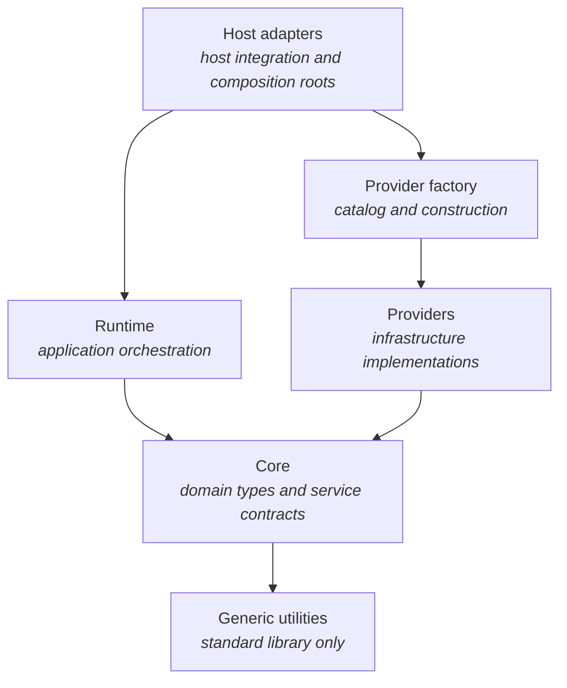

# Architecture

Chorus is a local LLM inference runtime built around a host- and provider-independent domain core. This document describes its architecture and the dependency rules, service contracts, and invariants contributors must preserve.

## The dependency model

Dependencies point inward toward the core. The runtime consumes core contracts; providers implement them. Neither depends on the other. Host adapters connect them through the provider factory.

- **Core** defines requests, events, errors, and service interfaces. It has no knowledge of hosts, vendor libraries, or concrete implementations.
- **Runtime** is the application layer. It owns validation, work identity, ordering, delivery, and lifecycle, using providers only through contracts.
- **Providers** implement those contracts. Each owns its vendor dependency; vendor types and headers stay inside the provider.
- **Provider factory** is the sole catalog and construction boundary. It turns a provider selection into a concrete instance and depends on providers, not the runtime or hosts.
- **Host adapters** translate host idioms into the runtime's typed API. All host-specific code lives here. Each adapter has a **composition root**: the initialization path that selects a provider, obtains it from the factory, and injects it into the runtime.
- **Generic utilities** depend only on the standard library and are available to every layer.

A **provider** implements a service contract. An **engine** is a live service instance created from a provider selection.

### Why dependencies point inward

Host APIs and vendor libraries change more often than domain concepts. Keeping those dependencies outside the core makes providers and hosts replaceable without changing the runtime. Core and runtime behavior can also be tested without a model, vendor library, or running host.

Do not move host behavior into the runtime or provider behavior into the core to avoid an adapter. Shared boundary types belong in a layer both sides may depend on; otherwise, convert at the boundary. A leaked type couples layers just as an include does.

## Service contracts

A service contract consists of an abstract interface, its value types, and its obligations: threading, callbacks, and error behavior. Contracts live in the core, and their headers are authoritative. Compiling against an interface is not enough to satisfy it.

Providers must reject work they cannot support before executing it, not silently degrade behavior. Unknown or unsupported options are errors, not no-ops. Runtime admission and provider validation are separate stages; validation failures after admission arrive as terminal events.

Consumers use contract types only. Naming a concrete provider, branching on its identity, or calling its provider-specific API violates the boundary. Consumers adapt to **declared capabilities**, not provider identity.

The catalog must always include a trivial, dependency-free reference provider. It keeps contracts compiler-enforced, exposes the impact of contract changes, and supports end-to-end tests without vendor libraries or model artifacts.

## Dependency inversion and composition

The factory constructs engines; composition roots wire them to consumers. Below a composition root, consumers receive providers through **dependency injection** and never select or construct them.

Vendor link dependencies follow the factory boundary. Inner layers and their tests must build without vendor libraries; only targets crossing that boundary need them.

## Boundaries and enforcement

| Boundary | Rule |
|---|---|
| Core | Includes only itself and generic utilities; never depends on the runtime, providers, host APIs, or vendor libraries. |
| Provider | Keeps vendor types, headers, and globals private; never depends on other providers, the runtime, or hosts. |
| Host adapter | Keeps host types and headers out of every other layer. |
| Provider factory | Owns the sole provider catalog and constructs engines from provider selections. Provider implementations and provider-specific tests may name concrete types. The runtime uses contracts; host adapters obtain engines through the factory. |

Convention and review enforce these rules; there is no automated layering check. Review must check:

- **Includes:** each file's includes declare its dependencies. A forbidden include is a defect regardless of how it is used.
- **Link dependencies:** a target that should be vendor-independent must build without vendor libraries.
- **Tests:** suites mirror the layers and follow their dependency limits. A core test requiring a model or a runtime test requiring a vendor library indicates a boundary violation in the code under test.

## Public API ownership

The public API is `Chorus::ChorusRuntime` (`include/chorus/runtime/runtime.hpp`) plus the provider factory. C++ consumers use it directly. Other consumers use host adapters: 
- Godot exposes
signals and properties, 
- the C ABI exposes handles and functions, 
- and language bindings wrap the C ABI. 

A new environment gets an adapter over this API, not another layer above it.

Headers under `include/chorus` are intentional downstream API commitments, not a way to share declarations internally. Private headers, including those shared within a layer, belong beside their implementations in `src/`.

- Public headers must not include private headers. Required types must be public or hidden behind opaque declarations.
- Moving a header into `include/` requires API review and a downstream consumer's need. Headers remain private by default.

## Threading and lifetime invariants

### Host thread and event delivery

- **Host-facing calls are thread-confined.** All host adapter calls into the runtime occur on one thread.
- **Provider callbacks may be asynchronous.** Providers may invoke callbacks from worker threads, so callback sinks must be thread-safe.
- **Events use a synchronized channel.** Provider signals never call host code directly. The runtime delivers them on the host thread when the host polls, and the host may block until the channel has work. Handlers must preserve published event identity even if an earlier handler stops or replaces the engine.
- **Accepted work terminates exactly once.** Every accepted request has one host-visible terminal event, including on cancellation, error, replacement, or shutdown. Work is never silently dropped.

### Engine handoff and shutdown

- **Handoff is exclusive.** A host may admit one identified load without waiting for the old engine to retire or the candidate to initialize. Acceptance immediately closes old preparation admission. The lifecycle worker fences old callbacks and resources before initializing the candidate.
- **Polling publishes readiness.** Between load acceptance and publication, no new inference or preparation work is accepted. Only polling the identified load success makes the engine ready; progress does not. Ordinary provider methods are host-thread confined after publication.
- **Load cancellation is cooperative.** An indivisible vendor operation may delay cleanup, but not load or cancellation admission. The cancellation terminal follows completed cleanup, with no fixed deadline.
- **Shutdown fences callbacks.** Once provider shutdown completes, no previously supplied callback may run again. Explicit stop and destruction remain blocking lifetime fences.
- **Release precedes acquisition.** The old provider is fully torn down before its successor initializes, preventing double residency of scarce resources such as GPU memory and loaded models.

### Request preparation

Each loaded runtime owns a small pool of preparation workers fed by one bounded FIFO queue. They consume immutable history snapshots through `Chorus::RequestPreparation`, not host-confined engine methods, and publish outcomes in admission order, so equal-priority requests reach the engine as submitted. Cached literal-content counts guide lazy selection; exact rendered checks determine fit. Validation and fitting failures after admission arrive as polled terminal events. Preview and count operations do not occupy inference sessions.

Replacement transfers the old lifetime to the exclusive lifecycle worker, which joins its preparation workers and releases provider resources before initializing the successor. Provider shutdown also revokes independently retained preparation handles before releasing their resources.

## Extensibility

**New provider:** implement the service contract and its threading and callback obligations, declare capabilities honestly, and register in the factory. Registration affects the catalog, display names, configuration metadata, build targets, tests, and documentation, but must not introduce provider-specific logic in the runtime or hosts. If that logic seems necessary, extend the contract deliberately instead.

Provider configuration schemas belong to the provider. Declare option names, types, defaults, and editor hints once through the contract's self-description mechanism, alongside capabilities. Every host reads that schema; none maintains its own copy.

**New host:** write an adapter over the runtime's typed API and preserve host-thread confinement. Nothing below the adapter changes. A language binding, C ABI, Node addon, or WebAssembly wrapper is also a host adapter.

**New domain concept:** extend the core vocabulary first, then update the outer layers. Core changes have the widest impact and require contract review.

## Source tree map

| Layer | Location |
|---|---|
| Core | `include/chorus/core/`, `src/chorus/core/` |
| Runtime | `include/chorus/runtime/`, `src/chorus/runtime/` |
| Providers | `src/chorus/providers/<provider>/` |
| Provider factory | `include/chorus/engine_factory.hpp`, `src/chorus/engine_factory.cpp` |
| Host adapters | `src/godot_chorus/` (Godot), `plugin/` (editor shell); `include/chorus_c/`, `src/chorus_c/` (C ABI) |
| Composition roots | Each host adapter's initialization path |
| Generic utilities | `src/wlib/` |
| Tests | `tests/`, mirroring the layers |
