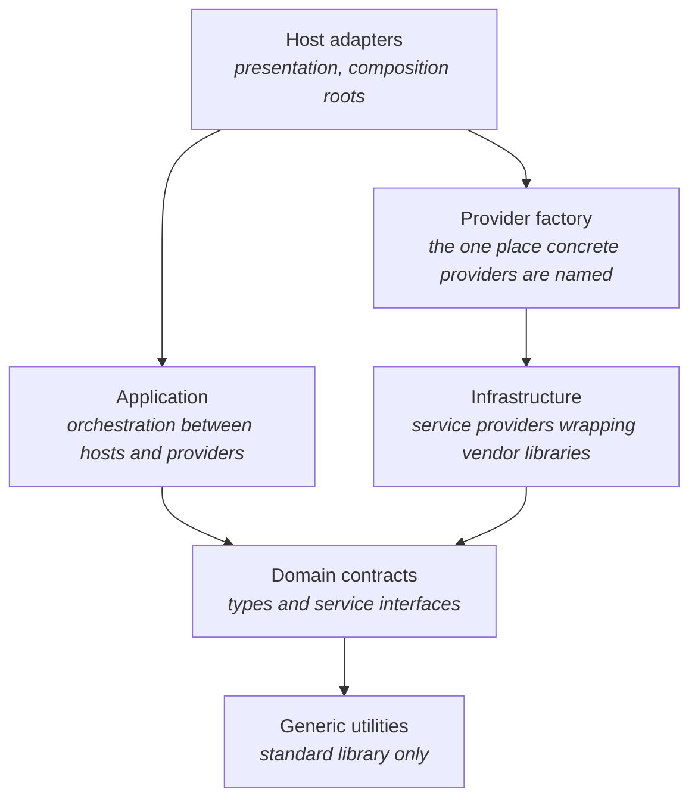

# Architecture

Chorus is organized as a directed dependency graph around a domain core
independent of hosts, providers, and vendor libraries. This document defines
the layers of that graph, the service contract model that connects them, the
boundaries contributors must respect, and the invariants every
implementation must preserve. This doc must be both "ought" and "is".

## The dependency model

Dependencies point toward the core. Application and infrastructure are
siblings, consumer and provider of the same contracts; neither knows the
other, and they meet only through wiring performed above them both.

Each node has a distinct kind of responsibility:

- **Domain contracts** define the vocabulary of the system: the request and
  event types, the error taxonomy, and the service interfaces that everything
  else programs against. This layer knows nothing about any host, any vendor
  library, or any concrete implementation.
- **Application orchestration** owns the lifecycle of work moving between a
  host and a service provider: validation, identity, ordering, delivery. It
  holds providers only through their contracts.
- **Infrastructure providers** implement the domain's service contracts by
  adapting an external library or system. Each provider owns its vendor
  dependency completely; the vendor's types and headers never escape it.
- **The provider factory** is the catalog: the single place where a provider
  selection becomes a concrete instance, and the only code allowed to name
  every provider. It depends on infrastructure and nothing higher.
- **Host adapters** translate between a host environment's idioms and the
  application layer's typed API. All host-specific code lives here and
  nowhere else. Each adapter contains a composition root: the initialization
  path where a provider is selected, obtained from the factory, and injected
  into the application layer.
- **Generic utilities** sit below everything: reusable tools with no
  dependencies beyond the standard library, includable from any layer.

A **provider** is any implementation of a service contract; a live service
instance built from a provider selection is an **engine**. The provider
factory is the bridge between the two: provider selection in, engine
instance out.

### Why dependencies point inward

Layers change at different rates: vendor
libraries churn with every upstream release, host APIs churn with every host
release, while the domain vocabulary changes only when the product's concepts
change. Pointing dependencies inward means volatile code depends on stable
code, never the reverse. Concretely, this buys three freedoms:

1. **Providers are replaceable.** A new inference library means a new
   provider, not a change to the application layer or any host.
2. **Hosts are replaceable.** The application layer can serve a different
   game engine, a CLI, or a test harness without modification, because
   nothing below the host adapters knows a host exists.
3. **The inner layers are testable in isolation.** Contract and orchestration
   behavior is verified without loading a model, linking a vendor library, or
   booting a host.

Do not move host behavior into the application layer, or provider behavior
into the core, merely to avoid writing an adapter. When data must cross a
boundary, either give the type a home in a layer both sides may see, or
convert at the boundary. Leaking a layer's types across a boundary couples
the two layers as surely as an include would.

## Service contracts

The system is built on a provider/consumer model.

**Contracts live in the core.** A service is defined by an abstract interface
plus the value types it traffics in. The contract specifies not just
signatures but obligations: threading guarantees, callback discipline,
error behavior. The contract header is the authoritative statement of those
obligations; an implementation that compiles but violates them is wrong.

**Infrastructure provides.** A provider implements a contract and is
otherwise invisible. Providers must be honest: a contract obligation a
provider cannot meet is grounds for rejecting the work up front, never for
silently degrading. Unknown or unsupported options are errors, not no-ops.

**The application consumes.** Consumers hold providers by contract type only.
A consumer that names a concrete provider, branches on a provider's identity,
or reaches around the contract to a provider's own API is a layering
violation, even when it would be convenient.

**Capabilities, not identity.** Providers differ in what they support.
Consumers discover those differences through the contract's self-description
mechanism (declared capabilities) and adapt to what is declared. This keeps
provider differences from hardening into `if (provider == X)` logic scattered
through the codebase: a new provider slots in by declaring what it can do,
and every consumer already knows how to react.

**A reference provider keeps the contract honest.** The catalog always
contains at least one trivial, dependency-free provider. It exists so the
contract stays compiler-enforced from day one, so consumers can be exercised
end-to-end with no vendor library or model artifact, and so contract changes
surface their full blast radius immediately.

## Dependency inversion and composition

Consumers depend on contracts; something must still decide which concrete
provider satisfies a request, construct it, and connect it to its consumer.
That work is split: construction belongs to the provider factory, wiring to
a composition root, the only place that holds both ends of a contract at
once. The principle is dependency injection: below a composition root,
consumers receive their providers from above and never construct or select
them. Link costs follow the factory: only code that crosses it needs a
vendor library at link time, so inner-layer code and its tests can build
without one, and the build stays honest about who depends on what.

## Boundaries and enforcement

The mandatory boundaries, and what may not cross them:

| Boundary | Prohibited |
|---|---|
| Around the core | Any dependency on the application layer, a provider, a host API, or a vendor library. The core includes only itself and generic utilities. |
| Around each provider | Vendor types, headers, or globals escaping into any other layer. Dependencies on other providers, the application layer, or hosts. |
| Around the host adapter | Host-environment types or headers appearing in any other layer. |
| Around the provider factory | Any second location that names concrete providers. |

The boundaries are enforced by convention and review; there is no automated
layering check. What review looks for:

- **Include discipline.** A file's includes are its dependency declaration.
  An include that violates the table above is a defect, whatever the code
  around it does.
- **Link seams.** Vendor libraries belong only in build targets that cross
  the provider factory. A target that should not need one but fails to build
  without it has crossed a boundary.
- **Test placement.** The test tree mirrors the layers, and each suite is
  restricted to the dependencies its layer permits. A core test that needs a
  model file, or an application test that needs a vendor library, signals a
  boundary violation in the code under test.

## Public API ownership

The public API is the application layer's typed API: `ChorusRuntime`
(`include/chorus/runtime/runtime.hpp`) plus the provider factory. A C++
consumer programs against it directly. Every other consumer reaches it
through a host adapter: the Godot node presents it as signals and
properties, a C ABI presents it as handles and functions, a language
binding wraps the C ABI. Supporting a new environment means writing a new
adapter over this API, never adding a layer above it.

`include/chorus` is a promise. A header lives there only when downstream
consumers are intentionally allowed to include it and build against it;
placement under `include/` is an API decision, not a convenience for sharing
declarations between translation units. Everything else, including headers
shared among a layer's own translation units, stays private under `src/`
beside its implementation.

Two rules follow:

- Public headers must not include private ones. If a public declaration
  needs a type, that type is either public too or hidden behind an opaque
  declaration.
- Moving a header into `include/` is a reviewable act of API design. The
  default answer is no; a header earns promotion when a downstream consumer
  earns it.

## Threading and lifetime invariants

- **Host-facing APIs are host-thread confined.** Everything a host adapter
  calls on the application layer happens on one thread, and the application
  layer may assume it.
- **Providers may be asynchronous internally.** A provider may run threads,
  and contract callbacks may arrive from any of them. Callback sinks
  supplied to providers must therefore be thread-safe.
- **Events cross the boundary through a synchronized channel.** Asynchronous
  provider signals are never delivered directly into host code; they are
  handed to the application layer's channel and surface to the host on the
  host's thread, at the host's cadence.
- **Shutdown fences callbacks.** After a provider's stop completes, that
  provider must never invoke a previously supplied callback again. Everything
  above relies on this to tear down safely.
- **Every accepted work item terminates exactly once.** Whatever happens
  (completion, cancellation, error, provider replacement or shutdown), the
  host observes exactly one terminal event per accepted request. Work is
  never silently dropped.
- **Exclusive resources are released before reacquired.** When a provider is
  replaced, the old one is fully torn down before its successor initializes,
  so scarce resources (GPU memory, a loaded model) are never doubly resident.

## Extensibility

The architecture's growth paths are the boundaries themselves.

**A new provider**: implement the contract, including its threading and
callback obligations; declare capabilities honestly, rejecting up front what
cannot be honored; register it in the provider factory. Registration has
ordinary ripples: a catalog entry, a display name, configuration metadata,
build targets, tests, documentation. What must not ripple is logic. If the
application layer or a host adapter needs new branches to accommodate the
provider, the contract is missing something; extend the contract
deliberately rather than special-case the provider.

Configuration metadata gets its own rule. A provider's configuration
surface (option names, types, defaults, editor hints) belongs to the
provider: declared once through the contract's self-description
mechanism, beside its capabilities, and read from there by every host. A
host adapter that hand-writes a provider's option schema is duplicating
knowledge the contract already owns, and every further host would have
to re-learn the same knobs by hand.

**A new host**: write a new adapter over the application layer's typed API,
observing host-thread confinement. Nothing below the adapter layer changes.
A language binding is a host like any other: a C ABI, a Node addon, or a
wasm wrapper is an adapter whose "idiom" is another language's calling
convention.

**A new domain concept**: extend the core vocabulary first, then let the
change flow outward through the layers. Core changes are the most expensive
kind; they are made deliberately and reviewed as contract changes.

## Source tree map

Where each part of the graph lives:

| Node | Location |
|---|---|
| Domain contracts | `include/chorus/core` (headers), `src/chorus/core` (implementations) |
| Application orchestration | `include/chorus/runtime`, `src/chorus/runtime` |
| Infrastructure providers | `src/chorus/providers/<provider>` |
| Provider factory | `include/chorus/engine_factory.hpp`, `src/chorus/engine_factory.cpp` |
| Host adapters | `src/godot_chorus` (Godot), `plugin/` (editor shell) |
| Composition roots | each host adapter's initialization path |
| Generic utilities | `src/wlib` |
| Tests, mirroring the layers | `tests/` |
